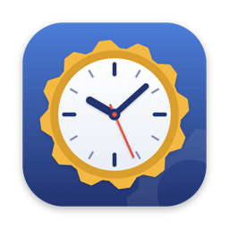
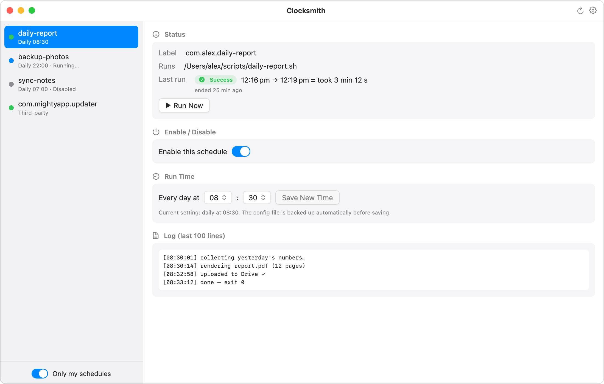

# Clocksmith

**See every scheduled job on your Mac — and know it actually ran.**

Clocksmith is a native macOS app (Swift/SwiftUI) for keeping an eye on the
scheduled background jobs in `~/Library/LaunchAgents` — the launchd agents
that run your scripts, backups, sync helpers, and the daily automations your
AI tools set up for you.

## What it does

- **Every job in one window** — yours and third-party, with live status dots
  (running / healthy / failed / disabled)
- **Last-run history from the system log** — start → end time, duration, and
  exit code, so silent failures are visible at a glance
- **Run now, enable/disable, reschedule** — with an automatic config backup
  before every change, and auto-restore if anything fails
- **Log viewer** for each job

Deliberately minimal: it doesn't create jobs, edit arbitrary plist keys, or
touch system daemons. It's a dashboard, not an editor — for full launchd
editing, LaunchControl and Lingon are excellent.

## Privacy

No telemetry, no network access, no account. Everything stays on your Mac.

## Get it

**[$4.99 one-time → shawnchiao.github.io/clocksmith](https://shawnchiao.github.io/clocksmith/)**

macOS 14+ · Apple Silicon & Intel · Signed & notarized · English / 繁體中文

---

*This repository hosts the Clocksmith website. The app itself is closed
source.*
